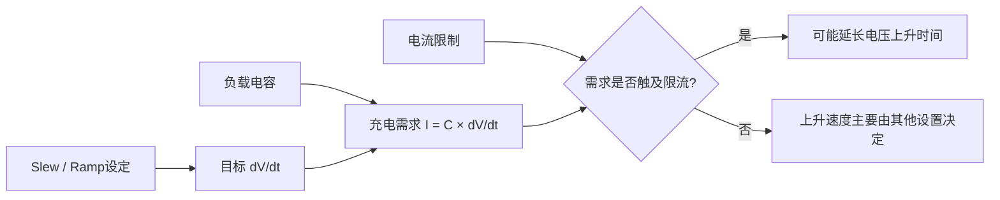

# ICLAMP 对 Force V 上升过程的影响

**来源：** 用户提供的问答。不同资源的 Force / Clamp / Slew 行为需依对应手册与配置核实。

## 原理判断

对主要呈电容性的负载，所需充电电流近似为 `I = C × dV/dt`。若电流限值过低且负载要求的充电电流触及限值，电压上升时间可能变长；若工作点未触及限值，单独降低 ICLAMP 不一定会改变 Force V 上升速率。

## 调试方法

1. 同时记录 Force V、实际端电压和电流随时间变化。
2. 核对 Slew / Ramp Rate、Current Limit、量程、负载电容和接线。
3. 在安全范围内改变一个参数，观察波形是否进入限流平台。
4. 如有 DUT 内部低阻路径或启动浪涌，先确认操作安全，再测量电源响应。

**避免误判：** 不要把 ICLAMP 当成通用的电压斜率控制旋钮；优先使用资源明确支持的 Slew / Ramp 配置。
