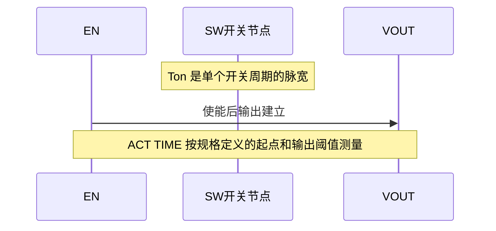

# Buck Ton 与 ACT TIME 测试区别

**来源：** 用户提供的多轮时序测试问答。`ACT TIME` 的正式定义要以产品规格 / 测试规范为准。

## 区别

| 项目 | Ton | ACT TIME（常见用法） |
|---|---|---|
| 时间尺度 | 单个或多个开关周期内的导通脉宽 | 使能或启动事件到规定输出 / 状态的系统时间 |
| 观察信号 | SW、Gate、LX 或规定测试点 | EN、VOUT、PG 等系统级信号 |
| 常见目的 | 验证定时、控制模式、Trim 和开关行为 | 验证启动速度、软启动与系统响应 |
| 常见误判 | 把周期脉宽等同于启动时间 | 不同规格对起止阈值定义可能不同 |

## 调试建议

- 在同一时间基准上采集 EN、VOUT、SW / PG，明确测量起止阈值。
- Ton 测试需确认频率、负载、输入电压、模式和测量边沿。
- ACT TIME 需确认输出目标阈值、Power Good 条件、放电初态和前置等待。
- RC Ton Trim 可影响开关时序，也可能间接影响启动表现；两项需分别判定，不用 ACT TIME 代替 Ton。
