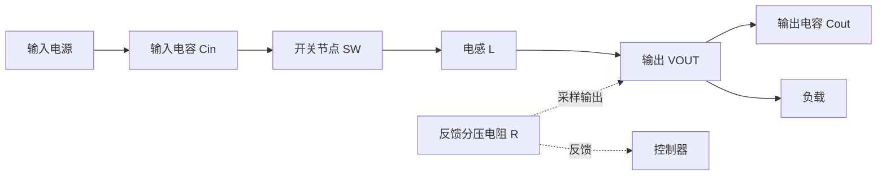

# Buck 外围 RCL 器件与故障线索

**来源：** 用户提供的电路基础问答。具体器件值需依据芯片数据手册和参考设计。

## Buck 功率路径

| 器件 | 主要作用 | 测试异常线索 |
|---|---|---|
| R | 反馈分压、设定电流 / 频率或补偿网络 | VOUT 偏差、检测斜率偏差、热漂移、阻值容差 |
| C | 输入去耦、输出滤波、储能和瞬态支撑 | 纹波、启动过冲、负载瞬态跌落、谐振或稳定性变化 |
| L | 储能并限制电流纹波 | 饱和、DCR、纹波电流及温升异常 |

## 排查建议

- 将 SW 波形、VOUT 纹波、电感电流和输入轨同步观察。
- 检查电感饱和电流、DCR、输入 / 输出电容有效容量及布局路径。
- 分开确认器件容差、温度影响和 ATE 负载；不要只依据单个直流电压判定 RCL 网络正常。
