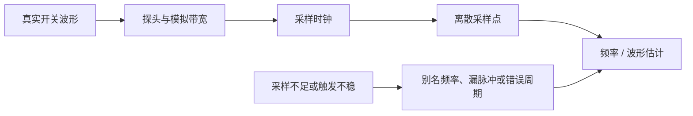

# Buck 开关频率采样与混叠排查

**来源：** 用户提供的采样频率问答。实际判断需考虑探头、带宽、采样时钟和测量算法。

## 基本关系

对带限信号进行理想采样时，采样频率需高于信号最高频率的两倍，才能避免理论上的混叠；实际示波器测量通常需要更高过采样率并使用合适带宽和抗混叠滤波。

| 观测问题 | 主要关注量 |
|---|---|
| 开关基频 | 采样率、记录长度、触发稳定性 |
| 边沿与尖峰 | 模拟带宽、探头接地、采样率 |
| 纹波幅度 | 探头环路、带宽限制、耦合方式 |
| 频率随负载变化 | 工作模式、跳脉冲 / PFM、测量算法 |

## 混叠示意

## 调试步骤

1. 先用合适的示波器和探头直接观察 SW 波形，再评估 ATE 频率量测结果。
2. 改变采样率或时基，确认估算频率是否稳定；若读值随采样配置变化，检查混叠和触发。
3. 加长记录时间以提高低频 / 跳脉冲测量的分辨能力。
4. 对脉冲跳跃、展频或非周期行为，不要把单一 Nyquist 公式当成充分的测量保证。
