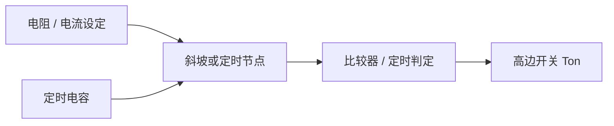

# Buck 的 RC Ton 修调与验证

**来源：** 用户提供的对话资料。具体 Ton 产生架构和修调方向由芯片设计定义。

## 概念

RC Ton 通常指利用电阻、电容及相关比较 / 控制电路设定开关导通时间。简化关系可用时间常数 `τ = R × C` 帮助理解，但真实 Ton 还可能依赖阈值、充放电电流、Trim 结构、输入输出状态和控制模式。

## ATE 验证建议

- 在规定输入、输出、负载和温度下测量 SW 导通时间；确认阈值定义和测量边沿。
- 扫描 Trim code，记录 `code → Ton`，检查单调性、步进、范围和饱和码。
- 若 Ton 随 VIN、VOUT 或负载变化，先区分架构的正常依赖与修调误差。
- 修调后复测开关频率、输出纹波、效率和边界负载；不要只优化单一 Ton 数值。

## 易混点

Ton 是单个开关周期中的导通时间；启动时间是从使能 / 输入条件到输出达到定义状态的系统级时间，两者不是同一参数。
