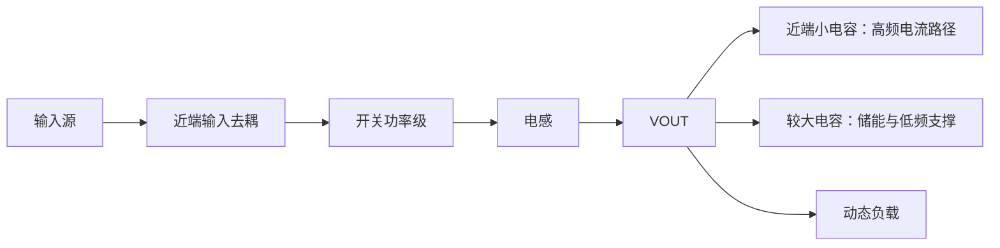

# Buck 输入输出电容与纹波排查

**来源：** 用户提供的多轮电容问答；公式用于理解趋势，具体选值依据芯片规格和实际网络。

## 频率与阻抗

理想电容容抗：`|Xc| = 1 / (2πfC)`。频率升高时理想容抗下降；真实电容还包含 ESR、ESL，超过自谐振频率后行为可能转为感性。

| 电容类型 | 常见作用 | 不能忽略的因素 |
|---|---|---|
| 大容量电容 | 提供较长时间尺度的能量储备，缓解较慢负载变化 | ESR、ESL、尺寸和有效容量降额 |
| 小型陶瓷电容 | 靠近开关回路，旁路较快的电流变化和高频噪声 | 封装寄生、直流偏压降容、自谐振 |

## 调试如何区分

- 输入端电容与回路布局影响开关瞬间输入电流和 VIN 纹波。
- 输出端电容、ESR、ESL 和控制环路共同影响输出纹波、过冲和负载瞬态。
- 用同一探头位置、带宽限制和接地方式比较 VOUT；区分周期纹波、开关尖峰和探测环路伪影。
- 轻载工作模式可能改变纹波形状；不要单凭“大小电容分工”推断异常根因。

## 工程补充

“大电容管低频、小电容管高频”是便于入门的近似说法。实际阻抗曲线由电容值、ESR、ESL、封装、偏压和 PCB 回路共同决定。
