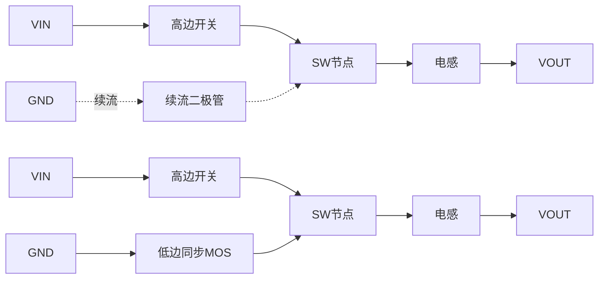

# 异步 Buck 与同步 Buck 的测试差异

**来源：** 用户提供的对话资料。以下框图为重绘的原理示意，并非特定芯片原理图。

## 功率级差异

| 维度 | 异步 Buck | 同步 Buck | 调试关注点 |
|---|---|---|---|
| 续流器件 | 二极管 | 低边 MOS | 低边驱动和死区会影响损耗与波形 |
| 主要导通损耗 | 与二极管压降和电流相关 | 与 MOS 导通电阻和电流平方相关 | 比较输入、输出功率及温升 |
| 轻载行为 | 常由二极管自然续流 | 可关断低边 MOS 或进入省电模式 | 观察跳脉冲、负电流和纹波模式 |
| 控制复杂度 | 相对简单 | 需避免上下管直通 | 检查栅极时序、死区和异常电流 |

## 工程判断

- “同步效率一定更高”不是所有负载、频率和工作模式下都成立；轻载控制策略、器件参数和驱动损耗也会改变结果。
- 双平台对比时，应固定输入电压、输出电流、温度、开关模式和测量带宽，再比较效率、纹波、启动和保护阈值。
- 若效率异常，优先同步测量输入 / 输出电压电流及 SW、栅极波形，避免只根据输出纹波推断功率级故障。

## 排查建议

1. 先确认 DUT 实际处于 PWM、PFM、跳脉冲或其他模式。
2. 检查高低边驱动、死区和 SW 节点振铃。
3. 在多个负载点测效率与纹波，并确认功率计 / ATE 量测带宽和连接损耗。
