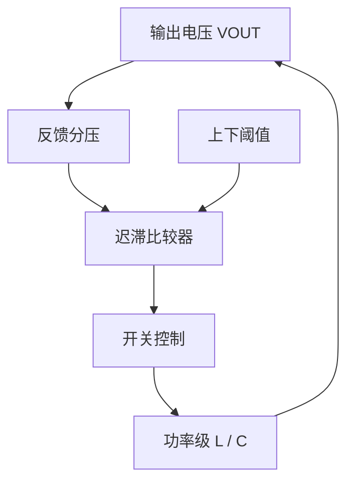

# 迟滞 Buck 工作原理与 ATE 测试

## 控制概念

迟滞控制器依据反馈电压相对上下阈值的位置控制开关。窗口大小、输出纹波和负载共同影响开关频率；不能默认其频率固定。

| 测试项 | 需要固定 / 记录的条件 | 易错点 |
|---|---|---|
| 滞环窗口 | 输出电压、负载、输入和温度 | 以单一工作点推断全条件窗口 |
| 开关频率 | 工作模式、输入、负载和测量带宽 | 把变频误判为时钟故障 |
| 纹波 | 探头位置、带宽、接地和负载 | 把开关尖峰当作低频纹波 |
| 负载瞬态 | 阶跃幅度、边沿、初始模式 | 只比较稳态值而忽略瞬态恢复 |

## 调试步骤

记录 VOUT 和 SW 波形；在轻载、重载及输入边界观察控制模式变化；确认判定窗口依据来自产品规格，而非未经验证的固定频率假设。
