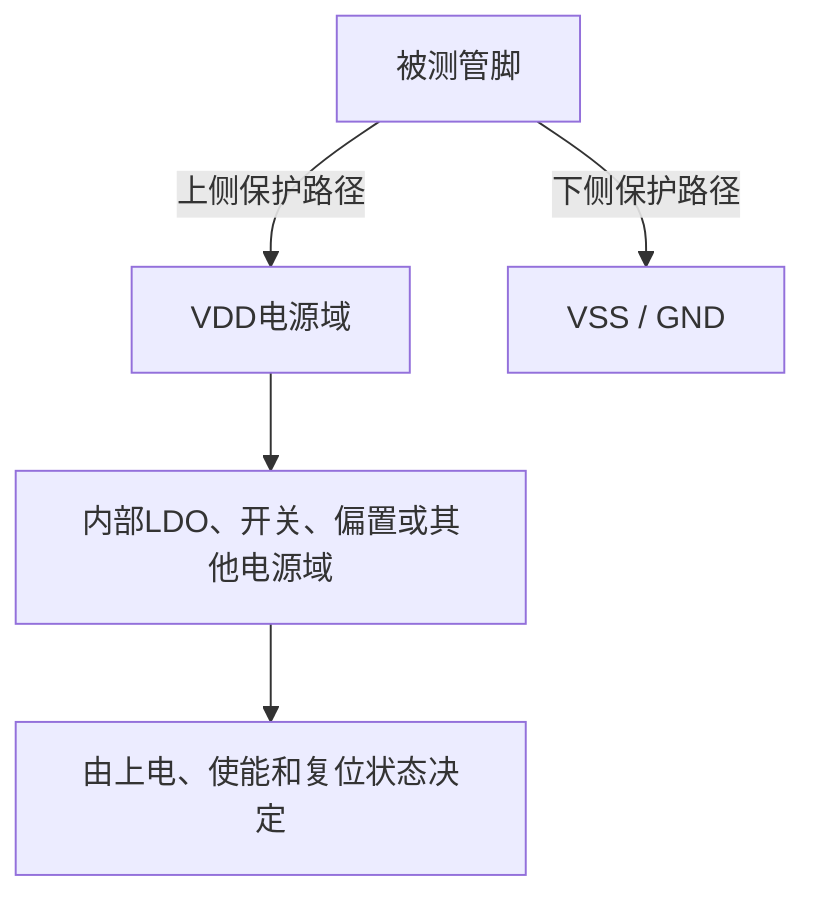
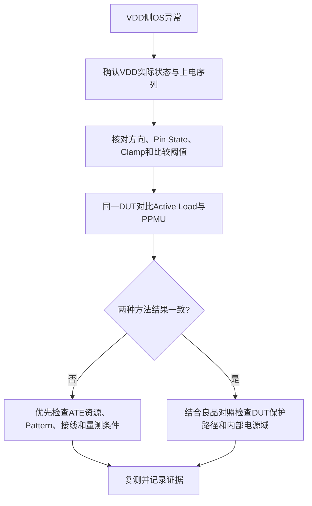

# PMIC 同一管脚 VDD 侧 OS 电压偏低或报 Open

**分类：** PMIC / OS / VDD 侧测试路径  
**状态：** 调查中，根因未确认  
**来源：** 用户提供的实际测试现象及对话记录

## 现象

- 对同一管脚进行 OS（Open / Short）测试时，VSS 侧结果正常。
- VDD 侧有时测得电压比预期低几十毫伏，有时读值约 1.5 V 并被判为 Open。
- 原始资料没有提供产品型号、Pin 电路图、测试电流、限值、DUT 电源状态和分布数据。

## 条件

- 测试方法：资料提及 Pattern + Active Load，也提及 PPMU 对照测试。
- 原对话中的测试电流示例：Active Load 约 1.5 mA、PPMU 约 200 µA；需要确认是否为该项目的实际设置及是否经过安全评审。
- VDD、VSS 电源状态、Pin 状态、Comparator 阈值、Force 方向和 Clamp 配置：待补充。

## 原理示意

VDD 侧与 VSS 侧的内部路径可能不对称。该图仅表示可能的路径，不代表此 DUT 的实际电路。

## 排查与发现

1. **确认电源域状态：** 在 VDD OS 测试前后测量 VDD；检查是否浮空、被其他资源驱动或受内部模块反向供电。比较良品与异常品。
2. **核对测试方向：** 比较 VDD 与 VSS 测试时的 Active Load / PPMU 方向、Pin State、Clamp、Comparator 极性和等待时间。
3. **比较测试方法：** 对同一异常 Pin 在获准的安全条件下比较 Pattern + Active Load 与 PPMU。记录两种方法的实际电流和电压，不只记录 Pass / Fail。
4. **做电流扫描：** 在规格和安全边界内改变测试电流，观察 VDD 侧读值变化。若电压随电流变化，需进一步区分串联阻抗、ESD 非线性和内部并联路径。
5. **做对照：** 交叉比较异常 Pin / 正常 Pin、良品 / 异常品、不同 Site / Tester / 接口硬件，并保留原始数据。

## 原因与处理

- **当前候选原因：** VDD 供电状态不确定、VDD 侧内部并联路径、测试电流 / 方向 / 比较条件不匹配、ATE 接触或资源差异，或 DUT 的保护 / 内部电路异常。
- **不能直接下的结论：** “Open 约 1.5 V”不单独证明 Pin 已断路；VDD 侧电压偏低也不单独证明 ESD 失效。
- **处理方式：** 先取得 Pin 电路与电源状态信息，再按上方对照实验逐项缩小范围。任何降低 / 增加 OS 测试电流的尝试须在产品安全限制内进行。
- **验证结果：** 待补充波形、实测 VDD、测试代码 / Pattern 和对照结果。

## 工程见解

最有区分力的第一组证据是：**异常发生时 VDD 是否处于确定状态，以及同一颗 DUT 在两种测试资源下的原始电压 / 电流是否一致。** 先排除测试条件和电源域状态，再判断 DUT 本体缺陷，能减少误判与无效换件。
