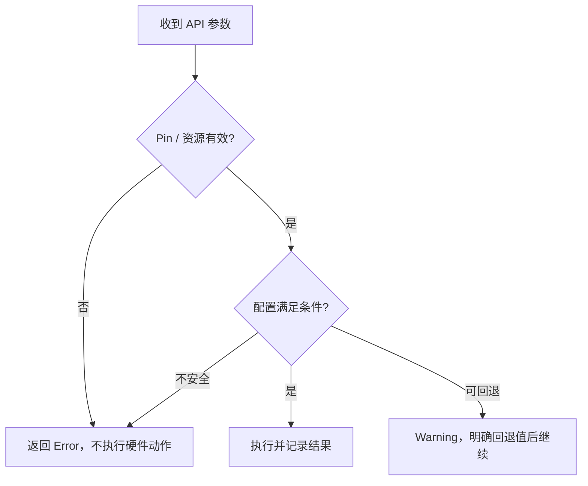

# ATE 无效 Pin 参数的错误处理与 Fail Fast

**来源：** 用户提供的 API 设计问答。93K 界面如何显示错误，须看具体框架和调用链。

## 建议规则

| 情况 | 建议处理 | 原因 |
|---|---|---|
| Pin 名称为空、无效或不属于已连接资源 | Error，并阻止该操作执行 | 请求无法按预期作用于硬件 |
| 可恢复的默认值或非关键配置 | Warning，并明确回退行为 | 用户仍能判断实际运行条件 |
| 硬件状态、量程或安全条件不满足 | Error；必要时停止当前测试步骤 | 防止无效量测或硬件风险 |

## Fail Fast

Fail Fast 是尽早发现错误并停止当前无效操作的设计方式。它不等于所有错误都必须终止整个量产流程：API 层应报告错误，Test Flow 层按错误等级和质量策略决定继续、跳过还是 Abort。

## 设计检查

- 错误内容包含无效 Pin、合法值 / 资源和调用位置。
- 错误发生前不产生部分硬件配置或不可逆操作。
- 批量 Pin 操作定义部分成功时的回滚 / 报告规则。
- Warning 必须能在日志和量产数据中被追踪。
