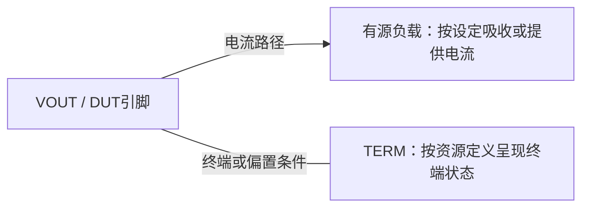

# ATE 有源负载 LOAD 与 TERM 模式

**来源：** 用户提供的对话资料。LOAD / TERM 的精确定义随测试机资源和软件接口而异，须查对应仪器手册。

## 功能理解

| 模式 | 典型用途 | 需要确认的设置 |
|---|---|---|
| LOAD | 主动吸收或提供设定电流，用于输出能力、负载调整率、限流和 OCP 测试 | 电流方向、量程、Clamp、建立时间、功耗和脉冲限制 |
| TERM | 对引脚提供指定终端 / 偏置条件，便于在数字或功能测试中建立确定的电气状态 | 终端电压、阻抗、漏电、方向及是否存在主动电流控制 |

## 排查建议

1. 不要仅凭“LOAD 要给电流、TERM 只给电压”作为跨平台定义；查清资源模式的电路行为。
2. 用仪器状态和电流方向确认 DUT 看到的是源、吸收、阻抗还是偏置。
3. 检查切换模式后的建立时间及 DUT 状态是否需要重置。
4. TERM 不等于“没有电流”；偏置网络、DUT 漏电和切换瞬态仍可能有电流。

## 工程补充

LOAD 更适合验证负载能力，TERM 更适合在特定功能 / 数字测试中设定端口条件；两者不可互换。具体模式名称和 API 语义应以板卡型号与版本文档为准。
