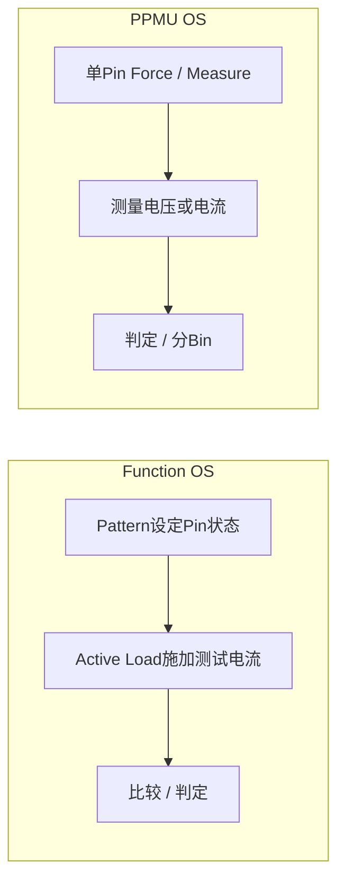

# Function OS 有源负载与 PPMU 测试对比

**来源：** 用户提供的问答提到一种测试采用约 1.5 mA，另一种 PPMU 测试采用约 200 µA。这些数值仅是该对话中的实例，不是通用规格。

| 方法 | 典型优势 | 主要风险 / 需要确认 |
|---|---|---|
| Function Pattern + Active Load | 可在功能序列中并行测试多个 Pin，适合快速筛查 | 负载方向、Pattern 状态、比较阈值、实际负载电流和 Pin 间相互作用 |
| PPMU Force / Measure | 单 Pin 或少量 Pin 的参数控制和量测较直接 | 多 Pin 测试时间、量程精度、接触和测试条件一致性 |

## 为什么测试电流可能不同

有源负载和 PPMU 的目的、量测方式、精度、并行度和比较裕量可能不同。提高电流可能增加开短路的电压差，也可能增加 DUT 内部导通、功耗或损伤风险。

## 调试建议

- 对照两种方法的 Pin 状态、负载方向、限值、接触路径和有效时间。
- 扫描测试电流，观察良品与开短路样品的分布间隔，而非直接照抄某个数值。
- 任何电流条件应由 DUT 规格、ESD / Pin 结构和质量评审批准。
