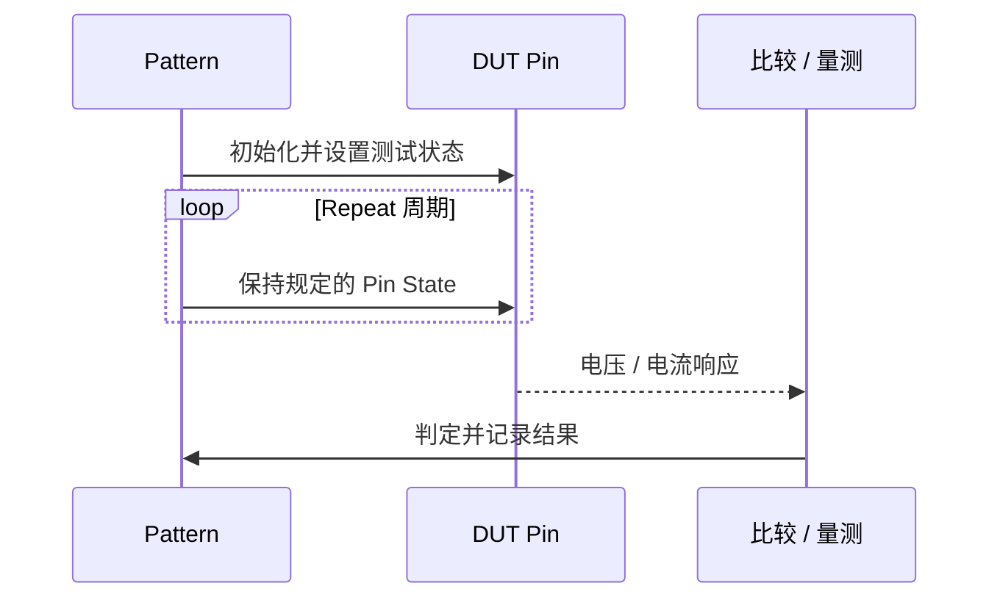

# OS 测试 Pattern 的 X 与 Repeat 作用

**来源：** 用户提供的 OS Pattern 问答。以下符号和电气状态须按实际 Pattern 格式核实。

## 现象与理解

OS（Open / Short）Pattern 中可能看到重复的 `X` 状态，例如 `00000X0`，并设置较大的 Repeat。常见目的可能是提供稳定时间、保持某种 Pin 状态或等待电气响应；`X` 本身不自动代表高阻，也不必然表示没有驱动。

## 调试步骤

1. 查看 `X` 对应的 Pin State、Drive / Compare、负载和终端设置。
2. 检查 Repeat 的单位、周期长度和实际等待时间。
3. 用示波器或资源状态确认 Repeat 期间引脚维持的电气状态。
4. 改变 Repeat 长度，验证结果是否与稳定时间或负载响应有关。

## 注意

Pattern 中的 Repeat 可能影响测试时间、引脚状态保持和热 / 功耗；只有确认 Pattern 语义后，才能确定其作用。
