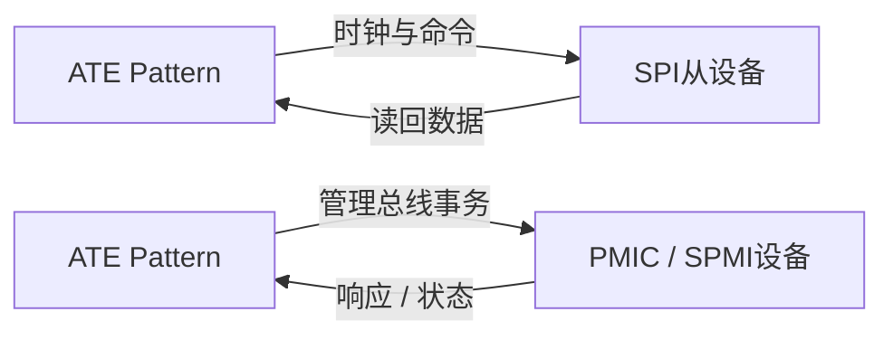

# SPI 与 SPMI 接口测试差异

**来源：** 用户提供的接口对比问答。具体协议能力、频率和事务定义以芯片与协议版本资料为准。

| 维度 | SPI | SPMI |
|---|---|---|
| 常见用途 | 通用同步串行接口，常用于外设配置与数据交换 | 面向电源管理系统的串行管理接口 |
| 信号 / 拓扑 | 常见为时钟、控制 / 数据输入、数据输出和片选 | 使用协议定义的管理总线信号和地址 / 仲裁机制 |
| 测试重点 | 模式、位序、片选、读写时序、响应数据 | 总线状态、地址 / 命令、协议时序、错误响应和仲裁行为 |
| ATE 风险 | CPOL / CPHA、驱动方向和输出使能错配 | 时序 / 协议状态、总线占用和设备配置复杂度 |

## 调试建议

将协议事务拆成初始化、写入、读回、错误条件和复位恢复；保存真实引脚波形与解码结果。不要只凭接口名称推断两者电气层或时序完全相同。
