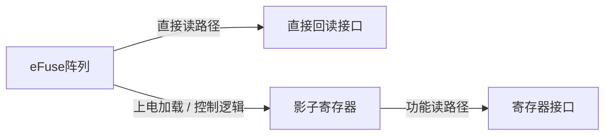

# eFuse 直接回读与影子寄存器回读

**来源：** 用户提供的 PMIC Trim 问答。具体存储架构、读路径和测试模式由芯片实现决定。

| 回读方式 | 可回答的问题 | 可能遗漏的风险 |
|---|---|---|
| 直接读 eFuse | 熔丝阵列中实际存储的码是否正确 | 不能单独证明上电加载和功能逻辑使用了正确值 |
| 读影子 / 功能寄存器 | 芯片功能路径当前使用的配置是否正确 | 若读路径共用同一加载逻辑，不能替代存储阵列验证 |

## 建议的 Trim 验证闭环

1. 编程前记录待写码和允许状态。
2. 编程后按产品流程直接回读存储值。
3. 复位 / 上电后读取影子寄存器或功能状态。
4. 测量对应模拟参数，验证码值确实产生预期效果。
5. 对不可逆编程使用明确的保护、校验和失败处理流程。

两条读路径是否都可用、是否需要复位、是否存在冗余映射，必须查芯片设计说明和量产程序。
