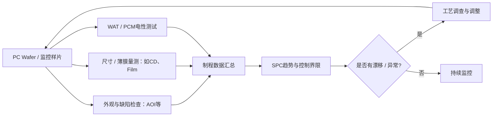

# PC Wafer 与 FAB 制程监控流程

**来源：** 用户提供的制造流程问答。PC Wafer 的缩写和用途可能随 FAB 定义不同，应以厂内流程为准。

## 监控流程示意

## 调试理解

- AOI 等光学 / 缺陷设备主要观察可见缺陷或图形状态；WAT / PCM 主要观察电性结构或参数。两类数据回答的问题不同。
- PC Wafer 可用于过程监控、设备 / 工艺验证或其他厂内目的，不能未经确认就等同于产品晶圆或所有 FAB 通用定义。
- ATE / WAT 数据需记录测试结构、Site、温度、仪器校准、时间和工艺批次，才能与工艺数据可靠关联。

## 排查建议

发现电性漂移时，先核对结构和测试方法、设备校准、接触与温控，再结合 AOI / 薄膜 / CD 等数据判断是否为制程变化。
