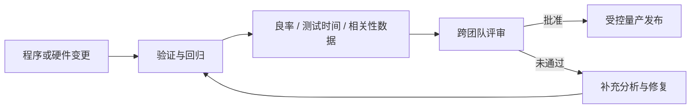

# PRU 报告与 CP 量产评审

**来源：** 用户提供的 PRU 问答。PRU 缩写在不同团队 / 流程中可能有不同展开，须先确认组织定义。

## 报告用途

本笔记把 PRU 作为项目程序更新 / 使用情况 / 评审类报告的统称，不对缩写作唯一解释。CP 量产评审可汇总程序变更、良率、测试时间、相关性、资源和放行建议。

| 评审内容 | 建议记录 |
|---|---|
| 程序变更 | 版本、变更原因、影响测试项、回归范围 |
| 良率与 Bin | 更新前后分布、异常批次、重测和失效码变化 |
| 测试时间 | 单颗时间、并行 Site、吞吐变化及瓶颈 |
| 相关性 | Tester / Site / 温度 / 平台 / CP-FT 对照结果 |
| 放行条件 | 已关闭风险、待办项、责任人和批准人 |

## CP 量产检查

确认测试程序与 Limit Table 版本一致，Trim 数据可追溯，晶圆坐标 / Wafer / Lot 对应正确，异常复测不会覆盖原始 Fail，并且量产变更已完成规定批准。
