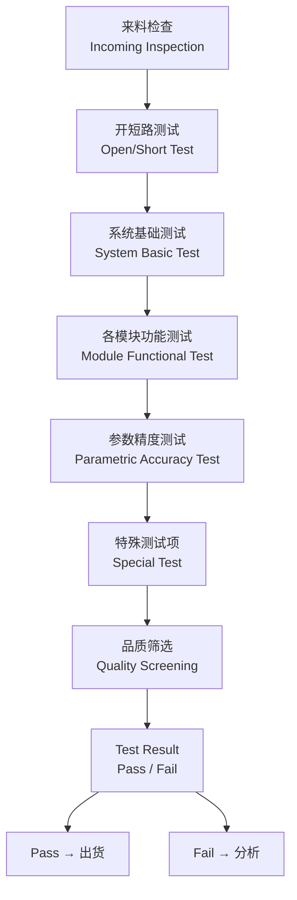

# PMIC FT 测试知识库索引 (PMIC Final Test Knowledge Base Index)

> **本知识库系统整理了 PMIC 各模块在 FT (Final Test) 阶段的测试原理与测试方法，涵盖从系统级测试到各子模块（LDO、Buck、Buck-Boost、ADC 等）的详细测试方案。**
>
> 与 [[PMIC/PMIC知识库/Trim测试知识库/_index_|PMIC 修调知识库（侧重 CP Trim 原理）]] 互补，本知识库聚焦于 **封装后 FT 阶段的功能验证与参数测试**。

---

## 1. 什么是 PMIC FT (Final Test)

**FT (Final Test)** 是芯片在完成封装 (Assembly) 后进行的最终测试。FT 的目的是：

- **验证 CP Trim 结果**：确认 CP 阶段写入的修调码 (trim code) 已正确生效
- **测试封装引入的缺陷**：如 bonding 开路/短路、non-wetting、封装应力导致的参数漂移
- **确保最终产品满足规格**：全温度范围、全电压范围的参数验证
- **筛选早期失效 (Infant Mortality)**：通过电压/温度应力筛选潜在缺陷

### FT vs CP 的区别

| 对比项   | CP (Chip Probe) | FT (Final Test)     |
| ----- | --------------- | ------------------- |
| 测试阶段  | 晶圆级 (wafer)     | 封装后 (package)       |
| 主要目的  | Trim 修调 + 良率筛选  | 功能验证 + 参数确认         |
| 可接触节点 | 所有 pad (探针)     | 仅封装管脚               |
| 测试项   | 偏重模拟参数修调        | 偏重系统功能与接口           |
| 温度测试  | 通常仅常温 (25°C)    | 常温 + 高温 + 低温        |
| 并行测试  | 探针卡并行           | 同测工位并行 (multi-site) |

### FT 测试流程概览



---

## 2. 知识库结构 (Knowledge Base Structure)

本知识库按照 PMIC 功能模块划分，每个模块独立成文：

| # | 模块 | 文件 | 主要内容 |
|---|------|------|---------|
| 01 | **系统测试项** | [[01_系统测试项.md]] | OS 测试、漏电、阻抗、关机电流、低功耗、OVP/UVLO、DFT 等 |
| 02 | **基准与参考源** | [[02_基准FT测试.md]] | VREF1P0、VBG、IREF、VPTAT、温度传感器 |
| 03 | **LDO 低压差线性稳压器** | [[03_LDO测试.md]] | 输出精度、LSW 阻抗、Ramp、缓起、OCP、静态电流 |
| 04 | **时钟与振荡器** | [[04_时钟测试.md]] | 1024K、38.4MHz、32K 时钟频率与精度 |
| 05 | **Buck-Boost 变换器** | [[05_BuckBoost测试.md]] | 缓起、IQ、OVP、SCP、输出精度/纹波、DCM/CCM、LX 频率 |
| 06 | **迟滞 Buck 变换器** | [[06_迟滞Buck测试.md]] | 效率/DMD、Ramp、缓起、OVP、SCP、输出精度、DCM 检测 |
| 07 | **电压模 Buck 变换器** | [[07_电压模Buck测试.md]] | 多相测试、Loadline、EA Clamp、TSENSOR、ECO 精度 |
| 08 | **电池管理** | [[08_SOH_EIS_库仑计.md]] | SOH (健康状态)、EIS (阻抗谱)、库仑计 (电量计) |
| 09 | **HKADC / XOADC** | [[09_HKADC_XOADC.md]] | ADC 转码精度、INL/DNL、上拉/下拉电阻 |
| 10 | **其他模块** | [[10_其他模块.md]] | LRA (马达驱动)、GPIO、CODEC |

---

## 3. 常见 FT 测试仪器与设备

### 3.1 ATE (Automatic Test Equipment)

| 设备平台 | 厂商 | 典型配置 | 适用场景 |
|---------|------|---------|---------|
| ETS-88 / ETS-364 | Teradyne | 数字通道 + 模拟板卡 + DPS | 消费类 PMIC FT |
| UltraFLEX / J750 | Teradyne | 高速数字 + 混合信号板卡 | 高端 PMIC / PMU |
| V93000 | Advantest | 模块化 PPMU + 混合信号 | 汽车级 / 工业级 PMIC |
| S100 / S200 | Advantest | 模拟/混合信号专用 | 电源管理芯片 |

### 3.2 板卡与仪器模块

| 模块类型 | 功能 | 典型应用 |
|---------|------|---------|
| **DPS (Device Power Supply)** | 提供 DUT 电源电压 | 系统供电、VDD 输入 |
| **PPMU (Per-Pin PMU)** | 每引脚 Force Voltage / Measure Current | OS 测试、漏电测试 |
| **AWG (任意波形发生器)** | 生成测试激励波形 | Ramp 测试、时序测试 |
| **Digitizer (数字化仪)** | 高速电压采样 | 纹波测量、瞬态响应 |
| **TMU (Time Measurement Unit)** | 时间间隔测量 | 缓起时间、TON/OFF 时间 |
| **频率计 (FC)** | 频率测量 | 时钟频率、LX 频率 |

### 3.3 外接仪器 (Bench Instruments)

| 仪器 | 用途 | 推荐型号 |
|------|------|---------|
| 数字万用表 (DMM) | 高精度电压/电流测量 | Keysight 3458A (8.5位) |
| 源测量单元 (SMU) | 精密源/测量 | Keithley 2400/2650 系列 |
| 示波器 (Scope) | 波形分析、时序测量 | Keysight MSOS804A (4GHz) |
| 电子负载 (E-Load) | 模拟负载电流 | Chroma 63600 / ITECH IT8800 |
| 温度试验箱 | 温度环境控制 | Espec / Thermotron |

---

## 4. 通用测试技术

### 4.1 开尔文 (Kelvin / 4-Wire) 测量

用于消除接触电阻和线阻对精密测量的影响：

```
Force Hi ————→ 接触电阻 → DUT 管脚 Hi
                         |
Sense Hi ————→           DUT 内部
                         |
Sense Lo ————→           DUT 管脚 Lo
Force Lo ————→ 接触电阻 →
```

**关键点**：Sense 路径无电流流动，因此 Sense 线上的压降 ≈ 0，测得的是 DUT 真实电压。

### 4.2 平均采样 (Averaging)

用于降低随机噪声对测量精度的影响：
- 每次测量采样 N 次取平均，噪声幅度降低 √N 倍
- 典型 N = 16 ~ 256，视所需精度和测试时间而定

### 4.3 Delta 测量 (自归零)

用于消除系统失调误差：
1. 测量背景噪声 (background)
2. 施加激励后测量信号 (signal)
3. 真实值 = signal - background

### 4.4 Guarding / Shielding

- **Guard (保护)**：有源屏蔽，使敏感节点的漏电流最小化
- **Shield (屏蔽)**：防止外部电磁干扰耦合到测量路径

---

## 5. 相关参考文件

| 文件 | 描述 |
|------|------|
| [[../FT.md|FT.md — FT 测试总览]] | PMIC 各模块 FT 测试项的完整清单 |
| [[../Trim.md|Trim.md — 修调总览]] | PMIC 各模块修调项说明 |
| [[../_index_.md|PMIC 修调知识库]] | 详细的 CP Trim 原理与流程 |
| [[../../ATE/ATE测试基础.md|ATE 测试基础]] | ATE 测试平台与编程基础 |

---

## 6. 术语表 (Glossary)

### 6.1 测试相关

| 术语 | 说明 |
|------|------|
| **FT** | Final Test，封装后最终测试 |
| **CP** | Chip Probe，晶圆级探针测试 |
| **ATE** | Automatic Test Equipment，自动测试设备 |
| **DUT** | Device Under Test，待测器件 |
| **Multi-Site** | 同测工位，同时测试多颗芯片 |
| **OS Test** | Open/Short Test，开短路测试 |
| **DFT** | Design for Test，可测试性设计 |
| **Guardband** | 保护带，测试限值比规格更严以补偿测试误差 |
| **Shmoo** | 扫描测试，可视化通过/失败区域 |
| **Bin** | 分 Bin，根据测试结果分类 |

### 6.2 电路参数相关

| 术语 | 说明 |
|------|------|
| **Load Regulation** | 负载调整率，负载变化对输出电压的影响 |
| **Line Regulation** | 线性调整率，输入电压变化对输出电压的影响 |
| **PSRR** | Power Supply Rejection Ratio，电源抑制比 |
| **Load Transient** | 负载瞬态响应 |
| **Droop** | 电压跌落 |
| **Ripple** | 输出纹波 |
| **Overshoot / Undershoot** | 过冲 / 下冲 |
| **Soft-Start Time** | 缓起时间，输出从 0 升至目标值的时间 |
| **Slew Rate** | 压摆率，电压变化速率 |

### 6.3 保护功能相关

| 术语 | 说明 |
|------|------|
| **OVP** | Over Voltage Protection，过压保护 |
| **UVP / UVLO** | Under Voltage Protection / Lockout，欠压保护/锁定 |
| **OCP** | Over Current Protection，过流保护 |
| **SCP** | Short Circuit Protection，短路保护 |
| **OTP** | Over Temperature Protection，过温保护（注意与 One-Time Programmable 区分） |
| **TSD** | Thermal Shutdown，热关断 |

---

## 7. 更新日志

| 日期 | 更新内容 |
|------|---------|
| 2026-07-24 | 初始化 FT 测试知识库，创建所有模块文档 |

---

> **本知识库持续更新中。结合 [[../FT.md|FT.md 测试总览]] 使用效果更佳。**
>
> 最后更新: 2026-07-24
